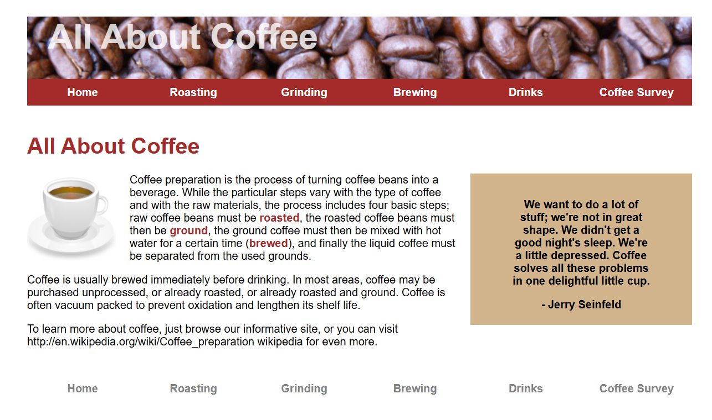

# ☕ All About Coffee

Welcome to **All About Coffee**, a delightful webpage dedicated to exploring the rich and aromatic world of coffee! From its history to its preparation methods, this project is your ultimate guide to the beverage that fuels millions every day.

<div align="center">
    
    <p><em>A visual representation of the coffee journey</em></p>
</div>

---

## Experience the website live ==> [**🔥Live Demo**](https://anirudha-8.github.io/all-about-coffee/)

---

## 📖 Table of Contents

- [☕ All About Coffee](#-all-about-coffee)
  - [Experience the website live ==\> **🔥Live Demo**](#experience-the-website-live--live-demo)
  - [📖 Table of Contents](#-table-of-contents)
  - [🛠 About the Project](#-about-the-project)
  - [✨ Features](#-features)
  - [🔧 Technologies Used](#-technologies-used)
  - [📋 Setup Instructions](#-setup-instructions)
  - [🤝 Contributing](#-contributing)

---

## 🛠 About the Project

"All About Coffee" is a tribute to one of the world's most beloved beverages. This project aims to inform, educate, and inspire coffee enthusiasts by providing engaging content, rich visuals, and easy navigation.

## ✨ Features

- **☕ Rich Content:** Detailed sections about coffee origins, types, and brewing methods.
- **📱 Responsive Design:** Optimized for all devices, from mobile to desktop.
- **🎨 Visual Appeal:** Aesthetic layout with beautiful images and colors.
- **🔗 Interactive Elements:** Links to additional resources for deeper exploration.

## 🔧 Technologies Used

- **🌐 HTML5**  
- **🎨 CSS3**  

## 📋 Setup Instructions

1. **Clone the repository:**

   ```bash
   git clone https://github.com/anirudha-8/all-about-coffee.git
   ```

2. **Navigate to the project directory:**

   ```bash
   cd all-about-coffee
   ```

3. **Open `index.html` in your browser:**
   Simply double-click the file or drag it into your browser.

---

## 🤝 Contributing

Contributions are always welcome! To get started:

1. **Fork the repository.**
2. **Create a new branch:**

   ```bash
   git checkout -b feature/YourFeatureName
   ```

3. **Commit your changes:**

   ```bash
   git commit -m 'Add your message here'
   ```

4. **Push to the branch:**

   ```bash
   git push origin feature/YourFeatureName
   ```

5. **Open a Pull Request.**

---

<p align="center">**Enjoy your coffee exploration!** ☕</p>
